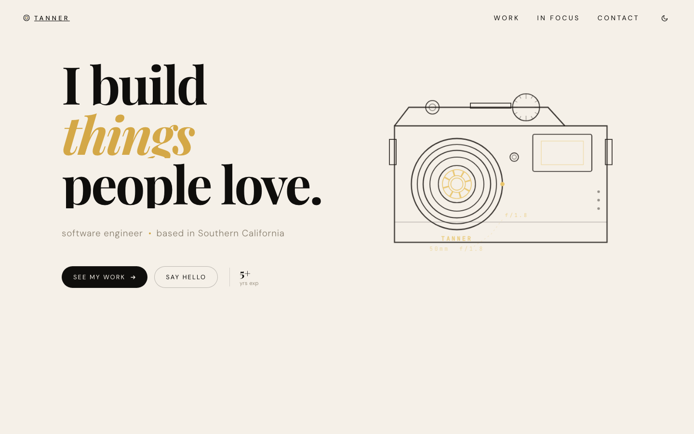
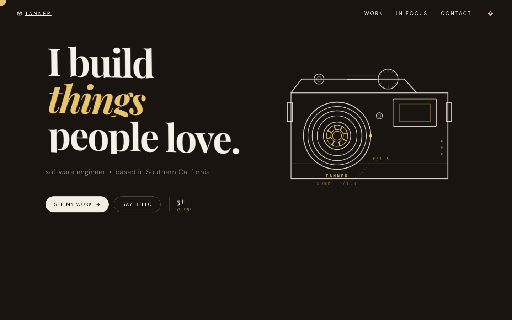
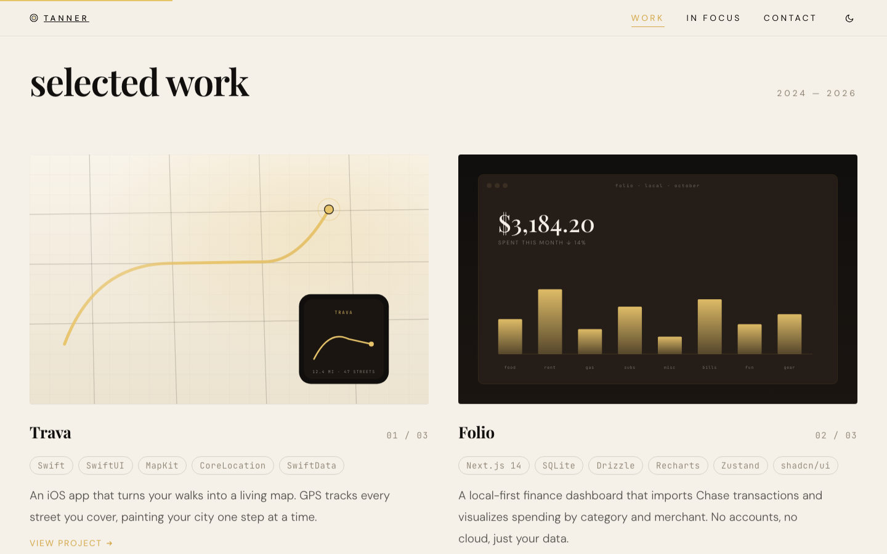
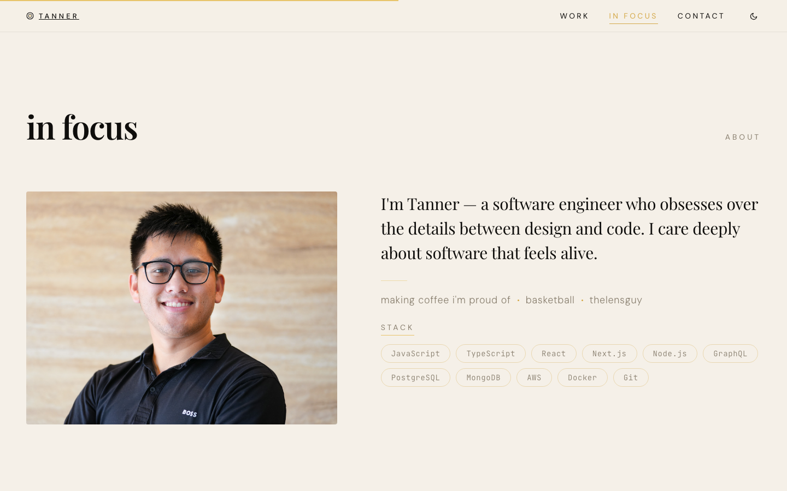
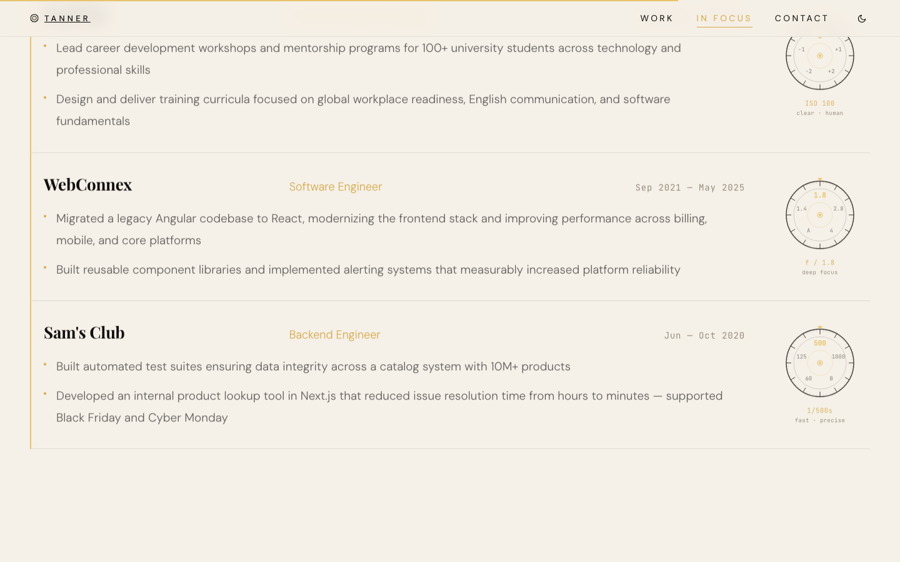
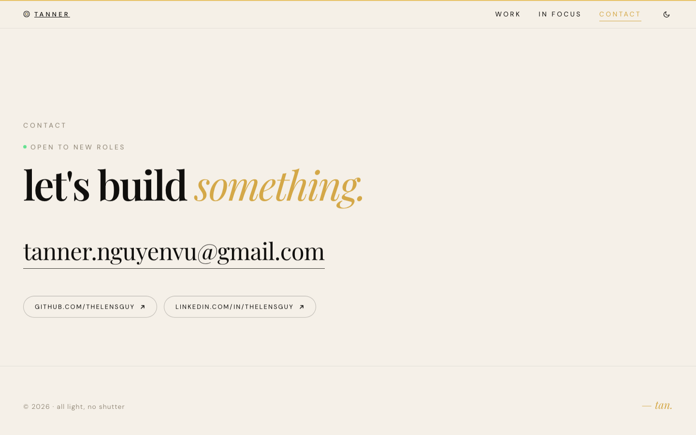

# thelensguy · Portfolio

Personal portfolio for Tanner Nguyen Vu — software engineer based in Southern California.





## Sections

### Selected Work


### In Focus




### Contact


---

## Stack

| Layer | Choice |
|---|---|
| Framework | React 19 + Vite 8 |
| Styling | Vanilla CSS (custom properties, no framework) |
| Animation | IntersectionObserver scroll-reveal, CSS transitions |
| Typography | Playfair Display · DM Sans · JetBrains Mono |
| Project art | Hand-crafted inline SVG scenes |

## Design tokens

```
--cream      #f5f0e8   light background
--ink        #0f0e0c   text / dark fills
--amber      oklch     accent (hue-adjustable at runtime)
--espresso   #1a1410   dark mode background
--warm-gray  #8a8070   secondary text
```

## Dev

```bash
npm install
npm run dev      # http://localhost:5173
npm run build    # production build → dist/
npm run preview  # preview production build
```

## Screenshots

Screenshots are generated with the Playwright CLI:

```bash
node scripts/screenshot.mjs
```

Outputs to `screenshots/readme/`.
